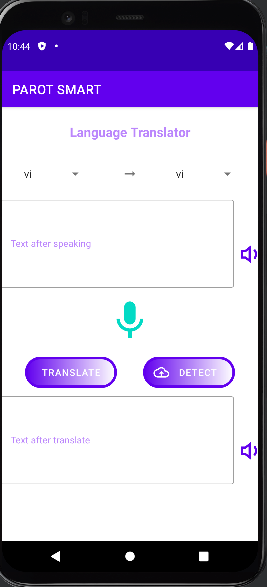
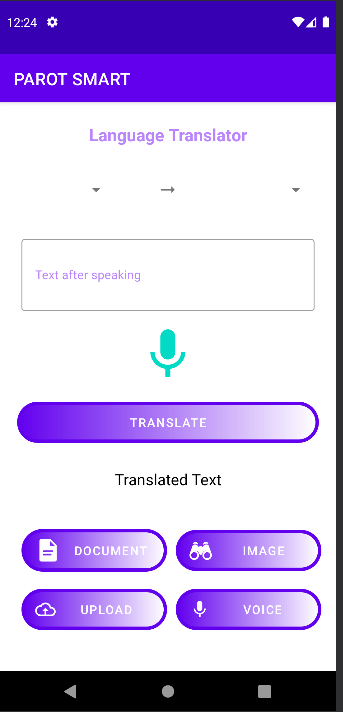
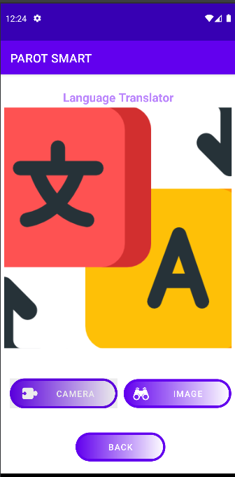

# Parot-smart
## I/Mô tả ứng dụng
* **Tên ứng dụng** : Dịch văn bản
* **Mô tả** : Ứng dụng Dịch Văn bản là một ứng dụng dịch đa ngôn ngữ được phát triển để hỗ trợ người dùng dịch văn bản, giọng nói, đoạn text copy và file, lưu lịch sử tra cứu, chia sẻ văn bản dịch và dịch ảnh.
* **Chức năng**:
* **Dịch giọng nói/ văn bản ** : Cho phép người dùng dịch giọng nói / văn bản từ ngôn ngữ gốc sang ngôn ngữ đích. Người dùng có thể chọn ngôn ngữ đầu vào và đầu ra để dịch.
* **Dịch trực tiếp bằng camera**: Cho phép người dùng dịch đoạn văn bản được sao chép từ ứng dụng khác. Người dùng có thể copy đoạn vừa dịch , share text cho ứng dụng khác 
* **Dịch ảnh**: Cho phép người dùng dịch văn bản trong ảnh từ ngôn ngữ gốc sang ngôn ngữ đích. Người dùng có thể chụp ảnh hoặc tải lên ảnh của mình lên ứng dụng để dịch.
## II/Cấu hình ứng dụng
* *SDK* : 30 API
* **Dịch vụ sử dụng** :Firebase ML Kit
* **Thư viện**: 
-ml kit translte : firse base
-ml kit vission : google
## III/DEMO APP

